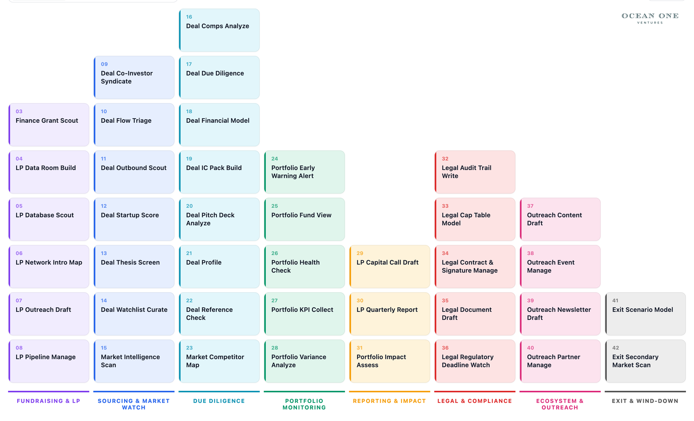

# Fund OS

Fund OS is the operating system that lets a small fund team run a complete venture-capital fund at the operational depth of a much larger institution — built on Claude Skills, MCP and the Claude Agent SDK.

## How it works

Each recurring fund task is a **Claude Skill**: a small, version-controlled unit of methodology with explicit instructions, inputs, outputs, knowledge references and a human-in-the-loop policy. Skills are grouped into **8 lifecycle phases** (fundraising to wind-down) and compose into **18 cross-skill workflows** that cover the recurring rhythms — weekly deal digest, monthly portfolio health check, quarterly LP report, capital calls.

Skills connect to the fund's actual tools through **MCP capabilities** (CRM, fund administration, meeting intelligence, productivity suite, wiki, calendar, email, web search, market data). The capability names are vendor-neutral; the fund maps each one to the actual MCP server in its `.mcp.json`.

**Human-in-the-loop is a design property, not a setting.** Every regulated artefact (LP reports, capital calls, legal documents, audit-trail entries) requires explicit human sign-off before delivery. Claude prepares, drafts and aggregates — the GP signs off.

The same skill bundle runs in Claude Desktop (Cowork), Claude Code, and the Claude Agent SDK for scheduled or headless runs. No re-implementation when switching hosts.

## Installation

### Prerequisites

- Mac or Windows with a terminal
- A GitHub account with access to this private repo (ask Ocean One Ventures to add you as a collaborator)

---

### Step 1 — Install Claude Code

If you haven't already:

```bash
# via Homebrew (recommended on Mac)
brew install claude-code

# via npm
npm install -g @anthropic-ai/claude-code@latest
```

If Claude Code is already installed, make sure it's up to date — plugin support requires a recent version:

```bash
brew upgrade claude-code
# or
npm install -g @anthropic-ai/claude-code@latest
```

---

### Step 2 — Start Claude in the terminal

```bash
claude
```

This opens the Claude Code interactive session. All `/plugin` commands below are typed inside this session.

---

### Step 3 — Install the GitHub CLI

The plugin installer needs `gh` to authenticate with the private GitHub repo.

```bash
brew install gh
```

Then authenticate:

```bash
gh auth login
```

Follow the browser OAuth prompts. Confirm it worked:

```bash
gh auth status
```

---

### Step 4 — Add the marketplace and install the plugin

Inside the Claude Code session:

```
/plugin marketplace add https://github.com/steffenmaas/fund-os.git
/plugin install fund-os@fund-os-marketplace
```

The first command registers the marketplace from the repo; the second installs Fund OS from it. Both only need to be run once.

To verify:

```
/plugin list
```

`fund-os` should appear at version `1.5.0`.

**Claude Desktop (Cowork)**

Plugin installation in Cowork is done through the UI — slash commands are not supported there:

1. Open Claude Desktop and switch to the **Cowork** tab
2. Click **Customize** in the left sidebar
3. Open the **Marketplace** section
4. Search for **Fund OS** and click **Install**
5. Review permissions and authorise

> If Fund OS doesn't appear in the Marketplace search, your organisation admin needs to add `steffenmaas/fund-os` as a private marketplace source under Organisation Settings → Plugins first.

---

### Step 5 — Configure MCP servers (optional but recommended)

MCP gives skills live access to your fund's tools. Without it, skills still work — Claude will ask you to paste data manually instead of reading it automatically.

Copy the example config into your project:

```bash
cp plugins/fund-os/.mcp.json.example .mcp.json
```

Edit `.mcp.json` and fill in your actual keys:

```json
{
  "mcpServers": {
    "crm": {
      "command": "npx",
      "args": ["-y", "@attio/mcp-server"],
      "env": { "ATTIO_API_KEY": "your-key-here" }
    },
    "fund-admin": {
      "command": "npx",
      "args": ["-y", "@bunch/mcp-server"],
      "env": { "BUNCH_API_KEY": "your-key-here" },
      "_note": "Read-only — never grant write access to fund admin."
    },
    "meeting-intelligence": {
      "command": "npx",
      "args": ["-y", "@granola/mcp-server"],
      "env": { "GRANOLA_API_KEY": "your-key-here" }
    }
  }
}
```

Full capability list and alternative vendors: [`plugins/fund-os/.mcp.json.example`](./plugins/fund-os/.mcp.json.example). Only configure the servers you actually use — everything else can be left out.

---

### Step 6 — Set up knowledge folders

Create four folders in your fund's Google Drive or Notion wiki and add them to your Claude project context (Claude Desktop → Project → Add Knowledge, or drag folders into a Claude Code project):

| Folder | Contents |
|---|---|
| `Fund-Framework/` | Investment thesis, scoring rubric, DD framework, impact framework |
| `Fund-Templates/` | Memo, health-check, LP report, capital-call templates |
| `Fund-Portfolio/` | One subfolder per portfolio company — KPIs, updates, cap table |
| `Fund-Market/` | Market intel, competitor maps, sector reports |

Skills both read from and write to these folders — health checks update `Fund-Portfolio/`, the market scanner refreshes `Fund-Market/`.

---

### Step 7 — Run your first skill

Type a trigger phrase in Claude:

```
/deal-flow-triage
```

or in plain language:

```
Triage this inbound pitch deck against our thesis
```

Claude activates the matching skill, requests any missing inputs, and walks you through the human-in-the-loop approval steps before producing output.

## What's in this repo

| Path | Contents |
|---|---|
| [`plugins/fund-os/`](./plugins/fund-os/) | Plugin root — 35 SKILL.md files across 8 phases, plugin manifest, MCP config example |
| [`plugins/fund-os/README.md`](./plugins/fund-os/README.md) | Full skill inventory, 18 workflows, installation details |
| [`plugins/fund-os/Fund_OS_Dashboard.html`](./plugins/fund-os/Fund_OS_Dashboard.html) | Interactive periodic table of all skills — open in any browser |
| [`.claude-plugin/marketplace.json`](./.claude-plugin/marketplace.json) | Marketplace manifest |

## Dashboard

[](./plugins/fund-os/Fund_OS_Dashboard.html)

Open [`plugins/fund-os/Fund_OS_Dashboard.html`](./plugins/fund-os/Fund_OS_Dashboard.html) in any browser. No server required.

Three views: **Periodic Table** (skills by phase, colour-coded), **Lifecycle Flow** (skills along the fund lifecycle), **Workflows** (the 18 orchestrated flows). A search panel lets you filter by skill name, slug, MCP capability or trigger phrase.

## Versioning

Single source of truth: [`plugins/fund-os/.claude-plugin/plugin.json`](./plugins/fund-os/.claude-plugin/plugin.json). Bump the version on every change and push to `main`. Clients with `autoUpdate: true` in their marketplace settings pick up changes automatically.

## How this repo is built

Skill files are generated from a single `skills-data.js` in the Fund OS upstream repo. Do not edit `SKILL.md` files directly — they are regenerated by `build-marketplace.js`.

## License

Proprietary. © Ocean One Ventures.
