# Autopilot modules

## Autopilot layer — human on the loop

Fund OS skills do the work when a person asks. The autopilot layer is the thin set of modules that
runs the same skills on a schedule, for the routine part of the work, without taking the decision
away from the people who own it. It rests on three ideas:

- **One switch per module.** Each module is `off`, `review-first` or `on`, and the switch is read
  before every act. `off` means the act is **queued** for a person; `review-first` means it is
  **drafted** (a reply in the mailbox, a campaign in the newsletter service) and a person sends it;
  `on` means it is **sent**, inside the guardrails.
- **A feed, written first.** Every act is entered in the audit feed *before* it runs: who, what,
  why, and how to undo it. The feed is append-only and is the single place a person looks.
- **Correction, not permission.** The person is *on* the loop, not *in* it: they read the feed,
  undo an act, follow up by hand, or move the switch. Only a person changes a switch; a module
  never changes its own mode, and never moves a record into a committed stage.

The graphics below are explanatory. Each one animates a single item along the module's path;
with `prefers-reduced-motion` set, the still frame shows the same information. They name generic
categories (CRM, mailbox, knowledge folder, document store, calendar, data providers, newsletter
service); nothing in them is specific to one fund.

**Guardrails, the same for every module**

- One reply per thread per 24 hours.
- No repeat recipient within 7 days.
- Declared purposes only: an act must belong to a purpose the module is set up for.
- A daily cap per module; the act over the cap is queued, not dropped.
- No move into committed stages. Stage changes, status changes and commitments stay with people.
- The switch is changed only by a person.

**Connectors.** The modules need generic categories of tool, not particular products. As examples
on claude.ai: Gmail (mailbox), Google Drive (document store), Google Calendar (calendar), your
CRM's connector, and a data-provider connector of your choice; the newsletter service is reached
through its own connector or API.

This page describes the model and the contract each module follows. The skills named below already
exist in the plugin and are what the modules compose.

---

## Inbound Dealflow Autopilot

An inbound pitch, by mail or by form, is turned into a CRM record (deduplicated against what is
already there), scored on the fund's own matrix, and answered in the fund's tone. What happens to
the reply depends on the switch: queued, drafted in the mailbox, or sent. The thesis and the scoring
matrix come from the fund's knowledge folder, so the same module serves any fund once those are set.
The module writes scores and fit fields only; it does not set stage or status. A pass or a "not
now" reply is still a reply and follows the same switch.

- **Trigger:** hourly run over the deal-flow mailbox and the form inbox.
- **Connectors:** CRM, mailbox, document store (thesis and matrix), optionally data providers for enrichment.
- **Skills composed:** `deal-flow-triage`, `deal-startup-score`.
- **Modes:** `off` — queued for a person · `review-first` — reply drafted in the mailbox · `on` — reply sent within the guardrails.
- **Guardrails:** one reply per thread per 24 hours; no repeat recipient within 7 days; declared purposes only; daily cap on replies; no move into committed stages; the switch is changed only by a person.

## Investor Outreach Autopilot

The module watches news and data providers for prospective investors, classifies each signal and
scores it on the investor matrix, and files the prospect in the CRM with where it was found. It then
prepares a first touch in the fund's tone that carries a booking link, and schedules follow-ups
until a call is booked. A booked call ends the module's part; a person takes over from there. First
touches and follow-ups are the acts the switch governs; the daily cap protects the fund's sender
reputation as much as the recipient.

- **Trigger:** daily scan of news and providers; follow-ups checked daily.
- **Connectors:** CRM, mailbox, calendar (booking link), data providers, document store (investor matrix, tone).
- **Skills composed:** `lp-database-scout`, `lp-investor-scoring`, `lp-pipeline-manage`, `lp-outreach-draft`.
- **Modes:** `off` — touches queued for a person · `review-first` — touches drafted in the mailbox · `on` — touches sent within the guardrails.
- **Guardrails:** no repeat recipient within 7 days; one reply per thread per 24 hours; declared purposes only; daily cap on first touches; no move into committed stages; the switch is changed only by a person.

## Newsletter Autopilot

The module screens the channels the fund follows, drafts an issue in the fund's layout from the
knowledge folder, and checks facts, links and that no private data has slipped in. It then drafts the
campaign in the newsletter service, where it waits for review. Review is part of the path: in
`review-first` a person approves and sends; in `on` the send happens once the checks pass and the
guardrails allow it. Nothing is sent to an audience the campaign was not declared for.

- **Trigger:** weekly screening run; one issue drafted per publishing cycle.
- **Connectors:** newsletter service, document store (layout, tone, previous issues), data providers or feeds for screening, CRM for the audience.
- **Skills composed:** `market-intelligence-scan`, `outreach-newsletter-draft`.
- **Modes:** `off` — issue queued for a person · `review-first` — campaign drafted in the service · `on` — campaign sent after the checks pass.
- **Guardrails:** declared purposes and audience only; daily cap on sends; no repeat recipient within 7 days; one reply per thread per 24 hours for any answers it triggers; no move into committed stages; the switch is changed only by a person.

## Meeting Notes Autopilot

After a meeting, the module reads the summary from the meeting-notes tool and matches it to a company
or person record in the CRM: first by the attendees' mail domain, then by a calendar attendee or a
person record, last by the name in the meeting title. It drafts a short note in the fund's tone and
checks it: no transcript, no address, no phone number, no link. Whether the note and its follow-up
tasks are filed or queued depends on the switch **and** on how sure the match is: a note is filed
directly only for a domain match with someone of the fund in the room; every other match is an
approval. A stage or status move the meeting decided is only ever proposed as an approval, and the
switch is read a second time right before every write, so a switch moved during the run takes effect
at once. The module never sends a mail or an invite.

- **Trigger:** weekday run over the last day's meetings.
- **Connectors:** meeting-notes tool, CRM, calendar (attendees), document store (tone), the Agent Workbench store.
- **Skills composed:** none of the interactive ones; the scheduled counterpart of taking notes by hand. Runbook: `ops-meeting-notes`.
- **Modes:** `off` — note, tasks and moves queued for a person · `review-first` — note filed on a sure match, tasks queued · `on` — note and tasks filed on a sure match.
- **Guardrails:** never a mail or an invite; the switch read again before every write; stage and status moves are approvals only, never into a committed stage; no transcript, address, phone number or link in a note; the switch is changed only by a person.

## Contact Sourcing Autopilot

The module turns the people the partners meet into CRM records. It reads three sources: the meeting-notes
tool (participants of the last days' meetings and people named in their notes), the mailbox (threads with
people the fund wrote to or answered, not bulk, not the fund's own domains) and the participant lists of
events in a folder of the document store (spreadsheets, one row per person). Every person is deduplicated
against the CRM by address, then company domain, then exact name and company; whoever exists is linked,
never created twice. The new ones are classified with the fund's playbook and thesis as startup, LP,
co-investor, strategic partner or other, with a confidence: only high and medium create anything, and
"other" stays out of the CRM. A startup becomes a company, a person and a deal-list entry at the first
stage with a first screening score; an investor a company, a person and an investor-list entry at the
target status with Fit and Timing scored from all the evidence at hand. The source is recorded on the
entry and in a note. For people met in person or by mail the module queues a follow-up mail draft and a
task as approvals; **it never sends a mail**, and the number of new records per run is capped, so a long
event list is worked off over several runs.

- **Trigger:** weekday run in the evening, after the meeting-notes run.
- **Connectors:** meeting-notes tool, mailbox, document store (event lists, playbook, thesis, tone), CRM, the Agent Workbench store; a data provider for free company lookups only (never a paid search).
- **Skills composed:** none of the interactive ones; it files what `deal-startup-score` and `lp-investor-scoring` score and what `lp-outreach-draft` would draft. Runbook: `ops-contact-sourcing`.
- **Modes:** `off` — only proposals, no CRM write at all · `review-first` — records, entries, scores and notes written, drafts and tasks queued · `on` — tasks written as well, drafts still queued.
- **Guardrails:** never a mail sent; new entries only at the first stage or the target status, never a committed one; at most the configured number of new records per run; low confidence and "other" create nothing; free lookups only; the switch is read again before every write; the switch is changed only by a person.

## Weekly Digest Autopilot

Every Monday the module reads the deal list, ranks it exactly as the Deal Cockpit does (score times
urgency, passes out, the deals that need attention first), and drafts the week's top deals in three
variants: an internal digest for the partners, a version for co-investors without scores, stage names
or valuations, and a LinkedIn draft that names no company in a late stage. A check holds those rules
before anything is queued. The result is one approval; a partner approves it and sends it from their
own mailbox. The module has no switch: it is always an approval, and it never sends, drafts a mail or
posts by itself.

- **Trigger:** weekly run, Monday morning.
- **Connectors:** CRM (the deal list), document store (thesis, criteria, tone), the Agent Workbench store.
- **Skills composed:** none of the interactive ones; the scheduled counterpart of curating the watchlist and drafting content by hand. Runbook: `ops-weekly-digest`.
- **Modes:** none; the digest behaves as `off` in every mode — one approval, nothing sent.
- **Guardrails:** an approval in every mode; at most seven picks, each a ranked name; no e-mail address or foreign link; no CRM write of any kind; a text that fails the check twice is not queued.

## Autopilot Switch & Feed

This is the layer the other modules share. Every act follows the same path: the module
proposes it, the guardrails check it, the module's switch decides whether it is queued, drafted or
sent, and the audit feed is written *before* the act runs. Afterwards a person can undo it or follow
up by hand. The feed shows the mode in force at the time of each act, so a change of the switch
is itself an entry. The switches are independent: one module can be `on` while another is `off`.

- **Trigger:** no schedule of its own. It is evaluated on every act of every module; a weekly read of the feed by a person is the suggested rhythm.
- **Connectors:** whichever store holds the feed (a CRM note stream, a document in the document store, or a table); the switch itself needs no connector.
- **Skills composed:** none directly; it wraps the skills of the other modules.
- **Modes:** `off` · `review-first` · `on`, per module; outcomes queued · drafted · sent.
- **Guardrails:** one reply per thread per 24 hours; no repeat recipient within 7 days; declared purposes only; daily cap; no move into committed stages; the switch is changed only by a person.
